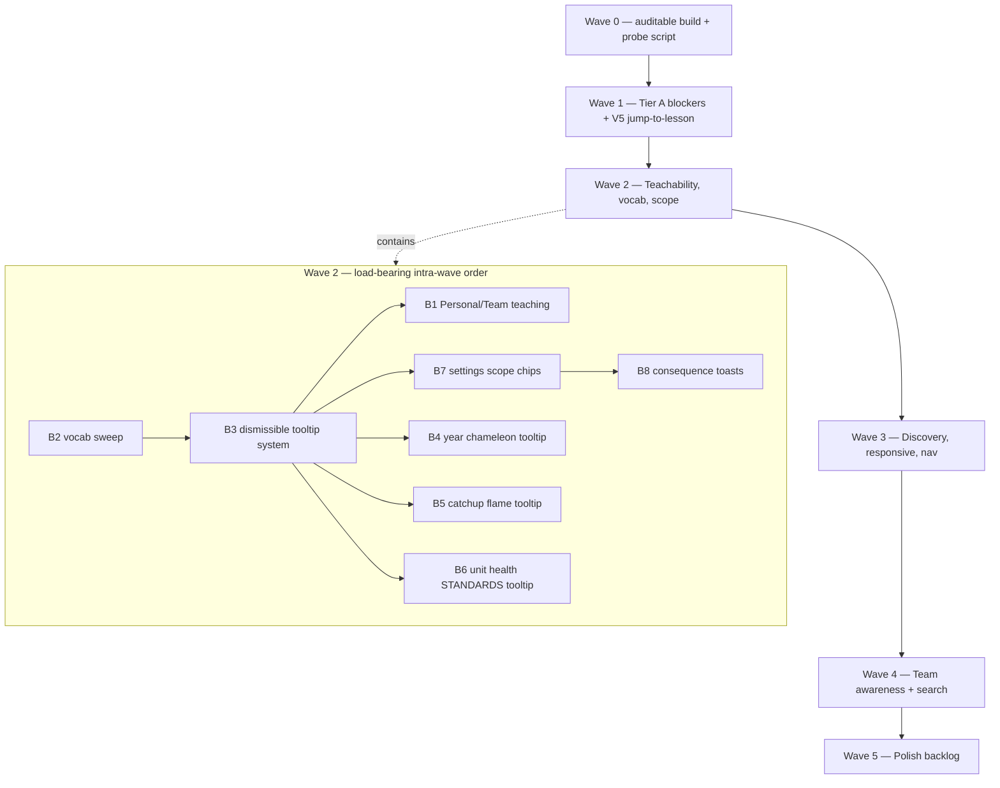

# Unified Audit Implementation Plan

> **Source:** Tim's reconciled merge of Claude + Codex audits (Section 0 = 11 fixed decisions). Original draft preserved by Tim; this version reconciles every file/line claim against `schedule-and-auth-5.24` HEAD (commit `3483db1`).
> **Branch:** `schedule-and-auth-5.24` (clean working tree).
> **Lens:** Beta-readiness for the late-August Grade 5 team. Rank by "does this block a real teacher from trusting and using the app."

---

## Context

Phase 1A is shipping in ~13 weeks. Two parallel audits + two cross-reviews produced the unified audit. Tim has fixed 11 binding decisions (vocabulary, tooltip model, popover-not-modal for Team mode, "future" treatment for placeholders, rails layout, Schedule discoverability, Catch-up scope, search-everything, minimal team awareness, Help via existing `?` overlay, filter panel scope).

This plan expands the unified audit into a wave/lane breakdown with the Section 0 decisions baked in as constraints and the Section 3 VERIFY items pre-resolved against live code (see `## Phase 1 — VERIFY results`). Each wave is parallel-safe internally; waves run sequentially because later waves register through earlier ones (tooltip dismissibility, scope chips, consequence toasts, etc.).

**Reuse precedent (every lane below references these):** 227 `<Tooltip>` callsites and 83 `Button tooltip=` props are already in production; ArchiveToast (`components/lesson-card/archive-toast.tsx`) is the proven pattern for transient bottom toasts; MasterBanner pulse-then-persist is shipping; `<EmptyState>` primitive (`components/ui/EmptyState.tsx`) is in production. **Extend, don't reinvent.**

---

## Wave dependency map

---

## Phase 1 — VERIFY results (deltas to unified audit Section 3)

| # | Audit claim | Live-code result | Plan delta |
|---|---|---|---|
| V1 | Filter panel closes on `/subject` mount | **CONFIRMED.** `SubjectView.tsx:1018-1027` runs `toggleLeftPanel()` once on first mount via `hasClosedPanelRef`; `left-filter-panel.tsx:153` only suppresses on `/daily*`. Default `leftPanelOpen=true` lives at `lib/app-state.tsx:294`. | **W3 lane (folded in below).** Delete the close-on-mount effect; let the global default carry per Decision #11. |
| V2 | SOON tabs in More menu | **SUPERSEDED.** No `soon: true` entries in `top-bar.tsx:66-91 VIEWS`. The `if (v.soon)` block at `top-bar.tsx:285` is dead-but-defensible — keep until rails refactor lands. | **Drop** the SOON-tab finding; SOON treatment now applies only to A6 placeholder controls + rail icons (C7). |
| V3 | `P \| M` collapse at narrow widths | **SUPERSEDED.** `top-bar.module.css:238-241` explicitly keeps full labels at every width; ToggleGroup primitive renders a single span per option so a dual-span CSS swap isn't possible without modifying the primitive. | **Folded into B2 vocab sweep** (the labels become "Personal" / "Team Curriculum" — the constraint is just verifying they still fit ≤360px). |
| V4 | Weekly right-rail content `/daily`-only | **PARTIALLY MITIGATED.** `WeeklyShell.tsx:889-901` already mounts `<RightRail>` with `mode="week"`. Runtime test at tablet/phone still needed. | C3 narrows to drawer-on-tablet/phone work only; desktop mount is done. |
| V5 | Subject→Daily jump-to-lesson broken | **CONFIRMED.** `SubjectView.tsx:943` pushes `/daily?lesson=${id}`; `DailyView.tsx` neither imports `next/navigation` nor reads `useSearchParams`; selectedId is seeded from "first not-done" only (`DailyView.tsx:1108-1113`). | **Promoted to Wave 1** as a real Tier-A bug (cross-route trust). |
| V6 | Catch-up flame vs in-grid bar | **PARTIALLY MITIGATED.** `CatchupWeekBar.tsx` already teaches the concept inline; `catchup-flame-button.tsx:46` only labels the button's count. | B5 narrows to flame badge concept tooltip only. |
| V7 | Tooltip/Button title fallback on touch | **CONFIRMED-FUNCTIONAL.** `Button.tsx:142,148` paints `effectiveTitle = title ?? tooltip` into the DOM BEFORE `Tooltip.tsx:269` strips it via `cloneElement`. Native long-press still fires because the Tooltip wraps the button — but the title= → undefined override only takes effect after the clone, leaving the original `title=` attribute on the rendered button. **OK as-is.** | No code change. Add a one-line comment near `Button.tsx:148` clarifying that `title=` is intentionally preserved on the rendered DOM for touch long-press, and `Tooltip.tsx:269`'s strip applies only to children that pass `title=` themselves. |

---

## Wave 0 — Make it auditable (blocks every later visual gate)

| Lane | Files | Outcome |
|---|---|---|
| W0-build | `npm run build` from clean (`.next/` is currently absent — confirmed). If `/weekly` 500s during local probe, trace via `scripts/probe-error.mjs` + page tree. | `npm run build` clean; `npm run dev` serves `/weekly`, `/daily`, `/year`, `/subject`, `/schedule`, `/catch-up`, `/settings/*` without console error. |
| W0-probe | Reuse `scripts/probe-dump.mjs` pattern (chromium + `CLAUDE_BYPASS_TOKEN` bootstrap). New `scripts/probe-uxa.mjs` capturing 360×800, 768×1024, 1280×900 screenshots of every route into `docs/screenshots/uxa-2026-05-27/<wave>/<route>__<tier>.png`. | Repeatable viewport check usable as the per-wave gate. |

**Gate:** Build clean, dev clean, probe script captures 21 screenshots (7 routes × 3 tiers) with no document-level horizontal scroll.

---

## Wave 1 — Tier A blockers + V5 jump-to-lesson (parallel lanes, file-disjoint)

| Lane | Finding | Files | Notes |
|---|---|---|---|
| W1-A1 | Nested buttons in Curriculum | `components/subject/SubjectView.tsx`, `SubjectView.module.css` | Same shape as the `ListRow` fix (precedent in `git log -- components/list/ListRow.tsx`). Row becomes a non-interactive container; open/expand + completion become sibling `<button>`s with separate `aria-label`s. |
| W1-A2 | Catch-up bulk actions are no-ops | `components/catchup/CatchupScreen.tsx:224-232`, `components/catchup/BulkActionBar.tsx:78-99` | `handleBulkCarry` calls `setAction(..., { kind: "carried", carriedTo: "" })` (empty target — UI mark only). `handleBulkAddToTodo` is a literal no-op + `clearSelection()`. **Recommend Open Question 1 → disable+rename for beta:** "Mark all carry-over" + remove "Add all to to-do" until backend lands. |
| W1-A3 | Daily 40px pane minimum | `components/daily/DailyView.tsx:181`, `DailyView.module.css` narrow blocks | The constant is `PANE_FLOOR = 40` (not `--pane-min`). Introduce `PANE_VISIBLE_MIN = 280` for content panes + keep `PANE_FLOOR = 40` only as the "fully collapsed" stub size. Add an explicit `collapsed` state (chevron toggle) so the splitter snaps either to ≥280 or to 40 — never to an in-between sliver. Update `clampPaneWidth` + `paneBounds` (`DailyView.tsx:199-229`) so the lower bound is 280 unless the pane is in `collapsed` mode. |
| W1-A4 | School week hardcoded Sun–Thu in Schedule | `app/(planner)/schedule/page.tsx:27` (`const SCHOOL_WEEK_DAYS: readonly number[] = [0, 1, 2, 3, 4]`), `components/schedule/SchedulePanel.tsx:77` (same constant) | Replace both with `useSchoolWeek()` from `lib/use-school-week.ts:144` and map the Weekday tokens → numeric day indexes (Sun=0..Sat=6 via `WEEKDAY_INDEX` already in that file). The `WEEK_DAYS`/`WEEK_DAYS_SHORT` exports in `lib/mock/index.ts:19-34` are fixture data with only 5 entries — keep using them for labels but iterate by the configured day indexes, not by their array order. Cross-check: `components/daily/DailyView.tsx:839,846,1599` and `components/weekly/weekly-board.tsx:131-132` already drive day count from `WEEK_DAYS.length` — when the school-week setter lands those will become configurable too; out of scope for W1 (call out as a Wave 5 cleanup line). |
| W1-A5 | Grade 5 leaks | `app/layout.tsx:12-13` (metadata title + description), `components/subject/SubjectView.tsx:842` (`headerMeta`), `components/catchup/CatchupScreen.tsx:269` (metaRow), `app/(planner)/year/print/page.tsx:166`, `app/(planner)/weekly/print/page.tsx:110` | The canonical reader is `useAppState().currentUser.curriculumLabel` (`lib/app-state.tsx:139,152,315,331,355`). Default is `"Grade 5"` — set by `lib/app-state.tsx:152`. Use that everywhere; omit the suffix when it's empty. Layout metadata becomes static "MyCurricula" (cannot read client state in a Server Component metadata export). |
| W1-A6 | Placeholder controls read as live | `components/year/YearView.tsx:443-468` (Filters + Export disabled buttons), `components/year/YearSidebar.tsx:141` (Calendar/Units/Lessons "Coming soon" items), `components/lesson-flow/section-resources.tsx:277-289` (Show more), `components/daily/ResourceComposer.tsx:840-842` (Search tile), `components/lesson-flow/section-toolbar.tsx` (any other disabled placeholder controls), schedule disabled options | Wrap in a single new `<FutureControl>` primitive (`components/ui/FutureControl.tsx`) so the Decision #4 "future" treatment (distinct visual + persistent "SOON" inline label, low opacity, outline-only, `cursor:not-allowed`) is consistent + removable in one place at release. Reuse `<Tooltip>` for the "Coming after beta" copy. Add to `components/ui/index.ts` barrel. |
| W1-V5 | Subject→Daily jump-to-lesson | `components/daily/DailyView.tsx:1108-1113` (selectedId initializer), `app/(planner)/daily/page.tsx` | Convert `app/(planner)/daily/page.tsx` to a Client Component shim that reads `useSearchParams()` and passes `lessonIdFromQuery` into `<DailyView />` as a prop (or refactor DailyView to import `useSearchParams` directly — DailyView is already `"use client"`). Use `lessonIdFromQuery` as the seed for `selectedId` if it exists in the day's lessons; fall back to first-not-done. Also call `router.replace(/daily, { scroll: false })` once consumed so the query param doesn't sticky-select on subsequent day changes. Verifies the link at `SubjectView.tsx:943`. |

**Gate:** Build/lint clean; Wave 0 probe rerun (no new horizontal scroll). Manual: click any `SubjectView` lesson → `/daily` lands on that lesson; drag Daily pane splitter → snaps to ≥280 or collapsed 40; switch school week to Mon–Fri in `/settings/curriculum` → `/schedule` + `SchedulePanel` show 5 weekday columns starting Monday.

---

## Wave 2 — Teachability, vocabulary & scope (intra-wave order is load-bearing)

Order: **B2 vocab sweep first** (downstream copy depends on it) → B3 dismissible tooltip system (B4/B5/B6 register through it) → B1 Personal/Team teaching → B7 settings scope chips (uses B2 vocab) → B8 consequence toasts → B4/B5/B6 concept tooltips.

| Lane | Finding | Files | Notes |
|---|---|---|---|
| W2-B2 | Vocabulary sweep — "Master" → "Team Curriculum"; "Personalized Curriculum"/"Core" → "Personal" | `components/shell/top-bar.tsx:478-486` (toggle labels), `components/shell/master-banner.tsx:33-72` (banner copy + filename comment), `components/weekly/save-target-dialog.tsx`, `components/lesson-card/context-menu.tsx`, `components/lesson-card/lesson-card.tsx`, plus all user-facing strings found via `grep -rn "Master\|Core Curriculum\|Personalized Curriculum" components/ app/` (97 occurrences as of HEAD) | **Keep `master` as internal code** (`editMode === "master"`, `useState<EditMode>("personal")`, localStorage keys, route segments). Touch user-facing strings + `aria-label`s + tooltip copy only. File `master-banner.tsx` keeps its name (no rename, just copy + comment update). Update `BUILD_STANDARD.md` after to retire stale references. |
| W2-B3 | Dismissible tooltip system — supersedes CLAUDE.md §4 | `components/ui/Tooltip.tsx` (add `tooltipId?: string` + dismissibility + `required?: boolean` opt-out), new `lib/tooltip-dismissal.ts` (localStorage `mycurricula:user:tooltip-dismissed:<id>` per-tooltip set + global flag `mycurricula:user:tooltips-off`), `app/settings/appearance/page.tsx` (add toggle: "Show onboarding tooltips" + "Reset dismissed tooltips" button), `CLAUDE.md` §4 (rewrite to the dismissible model) | Always-on exception list (ignore global flag + ignore per-id dismissal): Personal/Team toggle (`top-bar.tsx:474-491`), destructive actions (archive, delete), team-wide settings cards. Self-evident text buttons (Save/Cancel) don't add tooltips at all — supersedes the current CLAUDE.md §4 line about adding tooltips even to "Save". |
| W2-B1 | Personal/Team-mode teaching (popover + inline + banner) | `components/shell/top-bar.tsx:458-499` (toggle wrap), new `components/shell/team-mode-intro.tsx` (one-time popover anchored under the toggle; "Got it" dismiss), `components/shell/master-banner.tsx` (keep filename + verify copy uses "Team curriculum" — already in B2), new `lib/use-team-mode-edit-cue.ts` (returns class for ring/shading on editable fields in master mode), apply cue to lesson-card title/objective/section editable surfaces (`components/lesson-card/*`) | localStorage: `mycurricula:user:team-mode-introduced`. Per Decision #3: NO recurring confirm dialog — popover + banner + inline ring is the safety stack. The Master toggle is on the always-on exception list (W2-B3) so its tooltip never dismisses. |
| W2-B7 | Settings scope chips (Personal / Team Curriculum) | `app/settings/layout.tsx:34-49` (extend `SettingsTab` with `scope: "personal" \| "team"`), `app/settings/layout.module.css` (chip class on `.tabLink`), `components/appearance/settings-card.tsx` (add `scope?: "personal" \| "team"` prop + header chip rendering) | Vocabulary: **"Personal" / "Team Curriculum"** — NOT TEAM/YOU (Decision #2 supersedes the audit's first proposal). Curriculum + Catch-up are personal per Decision #7 (the recent scope clarification). Appearance is personal. Lesson templates is personal. Curriculum is team. |
| W2-B8 | Consequence toasts for team-scoped settings | New `lib/consequence-toast.tsx` (provider lifting the visual pattern from `components/lesson-card/archive-toast.tsx:38-184`), new `components/ui/ConsequenceToast.tsx`, mount provider once in `app/(planner)/layout.tsx` + `app/settings/layout.tsx`. Wire in `app/settings/curriculum/page.tsx` for: curriculum-label save, holidays add/remove, academic-year change, school-week change. | **Catch-up excluded** (now per-teacher per Decision #7). Copy names the team-wide effect explicitly: "Holiday added — every teacher's planner now skips Eid al-Fitr." 5s with Undo where reversible (Undo wires to the same setter inverse the ArchiveToast pattern uses). |
| W2-B4 | Year chameleon header — silent indicator | `components/year/QuarterMonthWeekHeader.tsx:41-63` | Wrap the header root in `<Tooltip content="Header color tracks the subject lane you're viewing — it shifts as you scroll between subjects" side="bottom">`. Enrich the existing `aria-label="Year timeline header"` to include the active subject name when `subjectId` is set (compute from `SUBJECT_BY_ID[subjectId]?.name`). |
| W2-B5 | Catch-up flame badge concept tooltip | `components/shell/catchup-flame-button.tsx:46-66` | Replace `content={label}` (current copy: "Open Catch-up screen (N items not covered)") with rich content: "**Catch-up** — lessons that fell behind and need a make-up plan. {count} item(s) pending. Click to triage." `CatchupWeekBar` already teaches the in-grid concept per V6. |
| W2-B6 | Unit Health STANDARDS stat tooltip + unit subtitle | `components/subject/UnitHealthCard.tsx:166-176` | Wrap the STANDARDS stat label in `<Tooltip content="Fraction of distinct standards covered by completed lessons in this unit." />`. Add 1-line subtitle below `unitName` (`.unitName` at line 138) — current data shape exposes `unit.standardsCovered/standardsTotal` and (verify when implementing) lesson count. |

**Gate:** Build/lint clean; probe rerun. Manual: clear localStorage + walk first-time-teacher path (`/daily` → `/weekly` → `/year` → `/subject` → `/settings/curriculum` → Team toggle). Verify vocab is consistent everywhere, tooltips fire once and stay dismissed, Team toggle shows popover→banner→inline-cue, settings sidebar shows scope chips, editing curriculum label fires a team-scoped toast.

---

## Wave 3 — Discovery, responsive & navigation (Tier C, file-disjoint lanes)

Plus the V1 filter-panel fix: delete the close-on-mount effect at `components/subject/SubjectView.tsx:1018-1027` so the planner default (`leftPanelOpen=true`) applies per Decision #11.

| Lane | Finding | Files | Notes |
|---|---|---|---|
| W3-C1 | Chrome slimming — relocate route-specific actions | `components/shell/top-bar.tsx`, per-route page chrome | Top bar answers only: "Where am I? Personal/Team? Where next?" + Help + Profile + Search. Every relocated control gets a documented discovery path (Help copy lane C8 must reference it). |
| W3-C2 | Schedule discoverability near Grid/List | `components/shell/top-bar.tsx:512-530` (Grid/List ToggleGroup); also `components/shell/GlobalRail.tsx` (already mounts Schedule globally per Decision #6) | Add a tertiary Schedule entry alongside Grid/List, OR a Grid/List/Schedule trio on Weekly only. Preserve `/schedule` route + GlobalRail icon. |
| W3-C3 | Weekly rail content tablet/phone drawer | `components/weekly/WeeklyShell.tsx:880-904`, `WeeklyShell.module.css`, `components/daily/RightRail.tsx` | Desktop mount already works (V4). Add a tablet/phone overlay drawer; the icon rail's panel buttons trigger the drawer instead of an inline pane below ~960px. |
| W3-C4 | Resource discovery — actionable rows + file-type icons + 20-cap signal | `components/subject/ResourcesSort.tsx:162-198` | Currently every row paints the same generic `<FileIcon />` (line 174) plus a textual `meta.glyph` badge. Make rows clickable (open resource URL or jump to lesson). Replace `<FileIcon />` with type-specific icons (PDF, Doc, Sheet, Slide, Link, Image). Add sort + search header. The footer "+N more — pagination coming in Phase 1B" is already at line 201-206 — keep, sharpen copy. |
| W3-C5 | Edit affordances — visible pencil on focus/hover | `components/daily/LessonDetail.tsx`, `lesson-detail.module.css` | Pencil icon on hover/focus near editable title/objective; tap on phone reveals the same icon. Keep dbl-click/Enter/F2 as secondary. |
| W3-C6 | Mobile Curriculum subject switching | `components/subject/SubjectView.tsx:1061-1075` (sidebar `<nav>`), `SubjectView.module.css` | At ≤480px, replace the horizontal scroll tab bar with a dropdown OR bottom-sheet picker. Truncated labels are not acceptable. |
| W3-C7 | Rail discovery + SOON-icon distinction | `components/shell/GlobalRail.module.css`, `RightIconRail.module.css`, `components/shell/rail-icons.tsx`, `components/shell/GlobalRail.tsx` | `cursor: grab/grabbing` on draggable icons; 2s pulse on first session (gated by `mycurricula:user:rails-drag-introduced`); SOON icons get distinct treatment per Decision #5 — outline-only + 70% opacity + inline mini-pill (not just dimmed). |
| W3-C8 | Help "?" overlay extension | `components/shell/global-shortcuts.tsx`, `components/shell/shortcuts-overlay.tsx:36-68` (SHORTCUT_GROUPS), `components/shell/top-bar.tsx` (add visible `?` icon button), new `lib/help-copy.ts` (route-aware copy registry keyed by pathname prefix) | Decision #10: extend existing overlay, don't build a new drawer. Add visible trigger, route-aware sections appended to SHORTCUT_GROUPS via `usePathname()`, and a "Replay onboarding tour" CTA that links to `/onboarding` (resumable per `lib/onboarding-state.tsx`). |
| W3-C9 | Sticky back affordance in narrow Daily detail | `components/daily/DailyView.module.css` narrow-mode block (`@media (max-width: 720px)` at line 997, `@media (max-width: 540px)` at line 1870) | `position: sticky; top: 0; z-index: 5; background: var(--paper);` on the "← Back to list" button when `data-narrow-pane="detail"`. |
| W3-C10 | Intro subtitles per main view | `app/(planner)/weekly/page.tsx`, `app/(planner)/year/page.tsx`, `components/subject/SubjectView.tsx`, `components/daily/DailyView.tsx` | Gate via `mycurricula:user:<view>-intro-seen` (read post-mount, SSR-safe — mirror the pattern at `lib/app-state.tsx:312-316` and `DailyView.tsx:1088-1095`). `/catch-up` already has a strong subtitle (`CatchupScreen.tsx:263-267`) — skip. |
| W3-C11 | Daily empty states | `components/daily/DailyView.tsx:1722` (empty day-list copy "No lessons planned for {WEEK_DAYS[selectedDay]}.") + the no-selection center state | Replace with `<EmptyState>` from `components/ui/EmptyState.tsx` (4 callsites today — extend, don't reinvent). |
| W3-C12 | Responsive collapse-cascade audit | All views. Output: `docs/responsive-cascade-2026-05-27.md` mapping every disappearing control at 1280/960/720/480 + its fallback. | Audit deliverable, not direct code. Fixes from the audit feed the next backlog wave. |
| W3-C13 | Daily reorder is local-only | `components/daily/DailyView.tsx:54-62` (existing comment block already documents this contract internally) | Add inline tooltip + on-first-drag toast: "Reordering is your personal view — your teammates still see the team order." |

**Gate:** Build/lint clean; probe rerun. Manual at 360/768/1280: chrome shows only universal controls; rail icons have grab cursor + SOON treatment; Daily back button stays at viewport top; intro subtitles fire once + persist dismissal; resource rows open something on click; filter panel visible on `/subject`.

---

## Wave 4 — Team awareness + search (Tier D, minimal viable)

| Lane | Finding | Files | Notes |
|---|---|---|---|
| W4-D1 | Notification surface + editing indicator | New `components/shell/NotificationBell.tsx` (top-bar slot), new `components/lesson-card/editing-indicator.tsx` (renders "Sara is editing — last change wins" badge on lessons with active editor), new `lib/realtime-presence.ts` (Supabase Realtime when backend lands; mocked subscription until then — use `lib/mock/teachers.ts` for the placeholder identities) | **Minimal scope per Decision #9**: bell with count, dropdown list, dismissal; lesson-level "someone else editing / last write wins" badge. Defer avatars + live cursors. |
| W4-D2 | Search = everything | `components/shell/top-bar.tsx:558-600` (search input + trigger; already wired into `useAppState().search` consumed at `WeeklyGrid.tsx:113,239,242`), new `lib/search-index.ts` (query lessons + standards + resources + comments) | Define result row shape (icon + title + breadcrumb + jump action). Open Question 5: if wiring all four sources reliably is too large, scope down for beta to lessons + standards with the other two showing "Coming soon" treatment in result groups. |

**Gate:** Search returns results from at least lessons + standards. Edit a lesson in one tab + open same lesson in another → editing indicator appears in the second tab.

---

## Wave 5 — Polish backlog (Tier E + near-term backlog)

- **Print fidelity** — A4 default page size for Qatar; explicit page-break-after for unit boundaries; black-and-white survival pass (subject color → patterned stripe fallback). `app/(planner)/*/print/*` + `@react-pdf/renderer` setup.
- **E1 SOON badge contrast** — `top-bar.tsx:299-302` + module CSS verify against WCAG AA (only matters if any SOON tab returns; otherwise drop).
- **E2 Banner at 360px** — `components/shell/master-banner.tsx` text wrap/overflow check after W2-B1 + W2-B2 copy changes.
- **E3 Shoutbox naming collision** — disambiguate "Shoutbox" (global) vs "Day Shoutbox" (per-day) per commit `3483db1`. `components/daily/Shoutbox.tsx` header copy + any aggregation pane label.
- **WEEK_DAYS configurable** — `lib/mock/index.ts:19-34` exports fixed Sun–Thu labels; Daily + Weekly render code uses them as label tables. Once `useSchoolWeek()` is the source of day count, replace the array indexing with a label-by-token lookup so weekday labels follow the configured school week.

---

## Open questions still needing Tim's decision

Flagged at the wave that needs them — surface to Tim before the wave starts.

1. **W1-A2 wiring path** — wire Catch-up bulk actions to real handlers (with target picker) OR disable + rename to "Mark as needs carry-over" / drop "Add all to to-do"? **Recommend: disable + rename for beta**; wire after backend lands.
2. **W2-B1 onboarding re-entry data safety** — does replaying the wizard pre-fill the teacher's existing config, or overwrite it? Needed before W3-C8 "Replay tour" CTA ships.
3. **W3 / W5 undo scope** — does Ctrl+Z cross the Personal/Team boundary? Can a teacher undo another teacher's Team edit?
4. **W4-D1 concurrent-edit conflict model** — last-write-wins indicator is the floor; what exactly happens when two teachers save the same lesson 100ms apart?
5. **W4-D2 search scope for beta** — all four sources (lessons + standards + resources + comments) OR lessons + standards only with the others showing "Coming soon"?
6. **Performance at realistic volume** (~1,152 lessons) — measure before W5; Year + Catch-up may need virtualization.

---

## Critical files / primitives to reuse (don't reinvent)

- `components/ui/Tooltip.tsx` — every new tooltip; extend in W2-B3 with dismissibility (don't replace).
- `components/ui/Button.tsx:142-188` — the canonical `tooltip` prop + native `title=` mirror lives here. New buttons should use `<Button tooltip="…">` not a manual wrap.
- `components/ui/EmptyState.tsx` — every empty surface (W3-C11).
- `components/lesson-card/archive-toast.tsx` — pattern source for W2-B8 ConsequenceToast.
- `lib/use-school-week.ts:144` (`useSchoolWeek()`) — W1-A4 source of truth.
- `lib/onboarding-state.tsx` — resumable; W3-C8 tour re-entry target.
- `lib/app-state.tsx:139,152` — `currentUser.curriculumLabel` and its `"Grade 5"` default; W1-A5 reads through this.
- `lib/app-state.tsx:312-316` — SSR-safe localStorage hydration pattern (W3-C10 intro subtitles).
- `lib/palette.tsx` + `lib/theme.tsx` — subject color + theme axes; never bypass.
- `components/shell/master-banner.tsx` — exists; W2-B1 reuses it + adds popover + inline cue layer.
- `app/onboarding/page.tsx` — tour re-entry destination.

---

## Audit-readiness checklist additions

For agents working subsequent cycles, add to the §5/§6 checklist:

1. **Consequence toast coverage** — every team-scoped setting commit fires `<ConsequenceToast>` naming the team-wide effect; Catch-up is intentionally excluded.
2. **Scope chip coverage** — every Settings sidebar tab + every team-scoped SettingsCard carries a Personal/Team Curriculum chip (not TEAM/YOU).
3. **Intro subtitle gating** — read localStorage post-mount, never useState initializer; SSR-safe per `lib/app-state.tsx:312-316`.
4. **Help copy currency** — new chrome ships with `lib/help-copy.ts` updated for that route.
5. **Tooltip dismissibility** — every new explanatory tooltip uses the W2-B3 system; high-consequence tooltips (Master toggle, destructive actions, team-wide settings) set `required` to ignore the global off switch.
6. **Vocabulary** — "Personal" / "Team Curriculum" everywhere in user-facing copy; `master` only as internal code (variable names, localStorage keys, route segments).
7. **"Future" treatment** — every placeholder/SOON control wraps `<FutureControl>` (or rails-equivalent treatment); never reads as broken-live.
8. **No parallel tooltip / empty-state / toast systems** — extend the primitives.
9. **Phone budget** — at 360px every primary action surface stays visible OR has a documented Help/More-menu fallback.
10. **Probe artifacts** — every PR includes `docs/screenshots/uxa-2026-05-27/<wave>/` set for affected routes at 360/768/1280.

---

## Per-wave verification gate

After each wave lands, in order:

1. `npm run lint && npm run format:check && npm run build` — clean.
2. Wave 0 probe script rerun — capture 360/768/1280 screenshots of every affected route.
3. No document-level horizontal scroll at any tier (CLAUDE.md §4).
4. All primary controls reachable at every tier; touch targets ≥44×44px on phone/tablet.
5. First-session walkthrough — clear localStorage + walk the new-teacher path; record where the teacher gets stuck.
6. Keyboard-only pass — Tab through every interactive surface; nothing trapped, every action reachable.
7. Screen-reader spot-check (VoiceOver/NVDA) on the surfaces touched in the wave — **neither original audit ran assistive-tech verification**; this is net-new coverage.
8. Record `Verified: 360 OK / 768 OK / 1280 OK / Keyboard OK / SR spot-check OK` in the wave's PR description.

---

## Out of scope (do not implement)

- RTL / Arabic locale support (Decision-level).
- Color-blind palette pass (Decision-level).
- Rich realtime presence (avatars, live cursors) — minimal D1 only.
- Per-school-week onboarding flow rebuild (the wizard is already production).
- Migrating away from existing primitives — `<Tooltip>`, `<EmptyState>`, ArchiveToast, etc. all stay.
- Renaming `master-banner.tsx`, the `editMode === "master"` enum value, or any `mycurricula:team:*` storage keys — B2 is a copy sweep, not a code-symbol rename.

---

*Section 0 decisions are fixed inputs; Section 3 VERIFY items are pre-resolved in the table above. Open questions are flagged at the wave that needs them — surface to Tim before that wave starts.*
